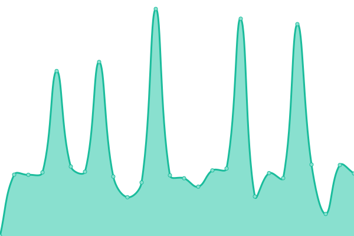

# [📈 Live Status](https://rainzee.github.io/RiotSkin4CN-Status): <!--live status--> **🟥 Complete outage**

This repository contains the open-source uptime monitor and status page for [rainzee wang](rainzee.wang), powered by [Upptime](https://github.com/upptime/upptime).

With [Upptime](https://upptime.js.org), you can get your own unlimited and free uptime monitor and status page, powered entirely by a GitHub repository. We use [Issues](https://github.com/rainzee/RiotSkin4CN-Status/issues) as incident reports, [Actions](https://github.com/rainzee/RiotSkin4CN-Status/actions) as uptime monitors, and [Pages](https://rainzee.github.io/RiotSkin4CN-Status) for the status page.

<!--start: status pages-->
<!-- This summary is generated by Upptime (https://github.com/upptime/upptime) -->
<!-- Do not edit this manually, your changes will be overwritten -->
<!-- prettier-ignore -->
| URL | Status | History | Response Time | Uptime |
| --- | ------ | ------- | ------------- | ------ |
|  [RiotSkin4CN-API](https://riotskin4cn.deta.dev/v1/public) | 🟥 Down | [riot-skin4-cn-api.yml](https://github.com/rainzee/RiotSkin4CN-Status/commits/HEAD/history/riot-skin4-cn-api.yml) | 

 137ms
     
 | 

<a href="https://rainzee.github.io/RiotSkin4CN-Status/history/riot-skin4-cn-api">100.00%</a>
    

|  [RiotSkin4CN-Download](https://s-cd-4307-general.oss.dogecdn.com/riotskin4cn/live.json) | 🟥 Down | [riot-skin4-cn-download.yml](https://github.com/rainzee/RiotSkin4CN-Status/commits/HEAD/history/riot-skin4-cn-download.yml) | 

 2268ms
     
 | 

<a href="https://rainzee.github.io/RiotSkin4CN-Status/history/riot-skin4-cn-download">99.73%</a>
    

<!--end: status pages-->

[**Visit our status website →**](https://rainzee.github.io/RiotSkin4CN-Status)

## 📄 License

- Powered by: [Upptime](https://github.com/upptime/upptime)
- Code: [MIT](./LICENSE) © [rainzee wang](rainzee.wang)
- Data in the `./history` directory: [Open Database License](https://opendatacommons.org/licenses/odbl/1-0/)
